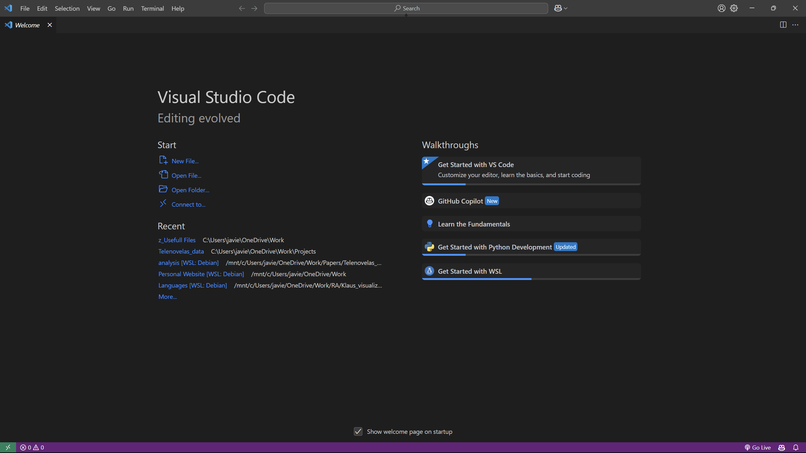
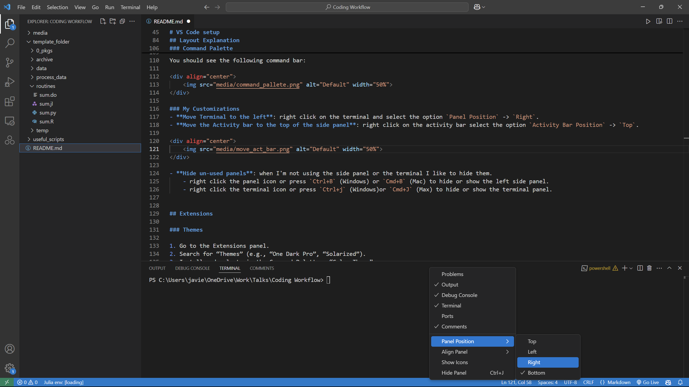
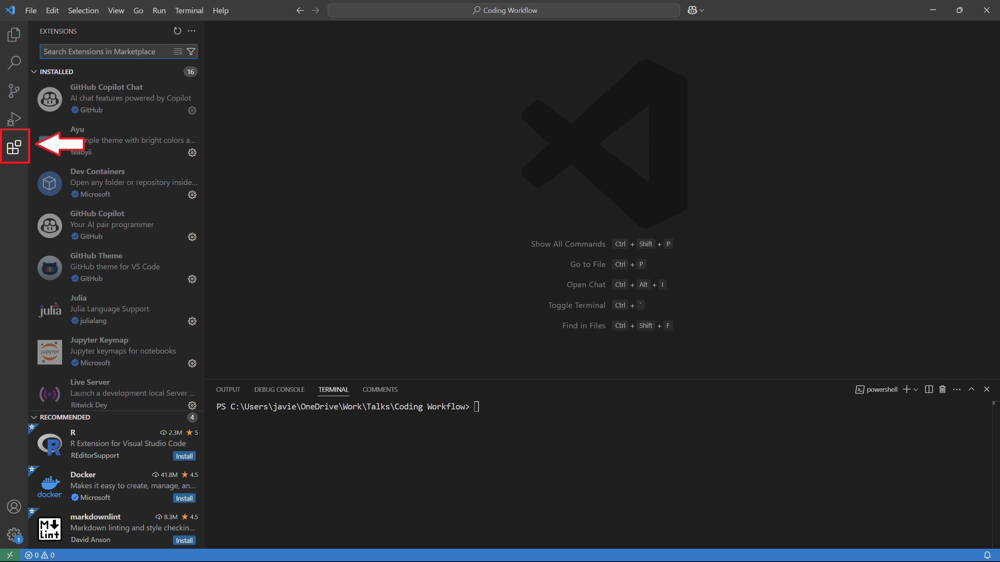
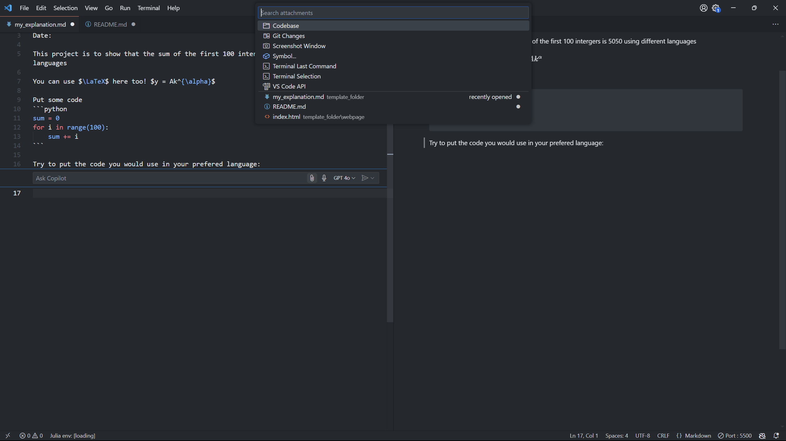
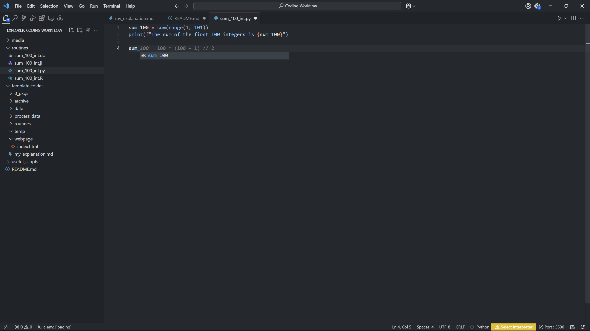
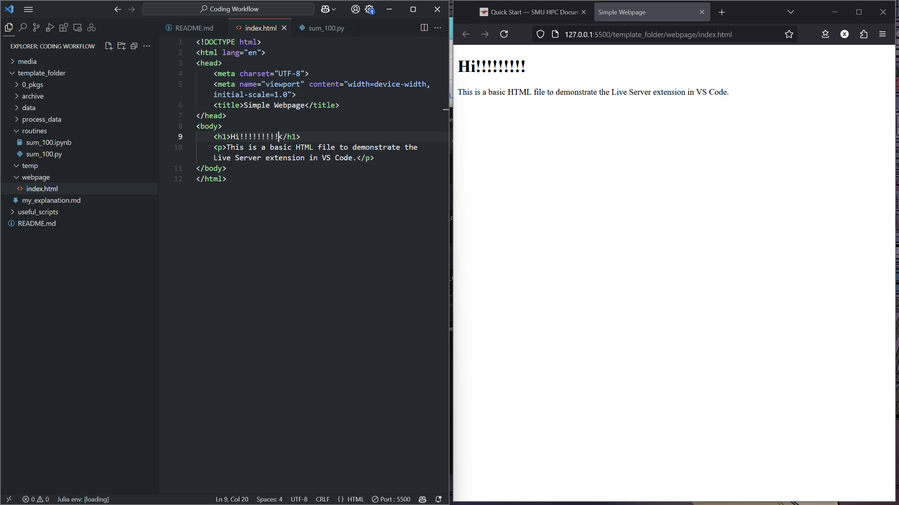

# My Coding Workflow
Javier Gonzalez - 2/13/2025

# Why VS Code?

- **Single program** for all your coding needs.
    - Run Julia, Python, and R scripts in one program.
    - You can edit and run Jupyter notebooks.
    - Connect to HPC resources or servers using remote access.
    - You could use it to even render and edit your $\LaTeX$ in here.
- **Extensions** let you expand its functionality (debugging, languages, linting).
- **GitHub Copilot**: Text generation chat bot without the need to open your browser!
    - It can even read your code and edit it inside the file.
- **Customization**: how it looks and what tools you use to help you coding. 
    - This [Youtube video](https://www.youtube.com/watch?v=9_I0bySQoCs) shows how to completely redesign the look of VS Code.

    <table>
        <tr>
            <td align="center">
                
                <figcaption>Default</figcaption>
            </td>
            <td align="center">
                
                <figcaption>Customized</figcaption>
            </td>
        </tr>
    </table>

# Download VS Code from scratch

## Instructions for Windows
1. Go to [Visual Studio Code Downloads](https://code.visualstudio.com/download).
2. Select **Windows** download. 
3. Follow the installer prompts. 
4. Launch VS Code and customize according to your preferences.

## Instructions for MacOS
1. Go to [Visual Studio Code Downloads](https://code.visualstudio.com/download).
2. Select **macOS** download.
3. Drag and drop the app into your **Applications** folder.
4. Open VS Code. Confirm that macOS security settings allow opening apps from outside the App Store.

# Open the `template_folder`

There is two ways of opening a folder with VS Code.


1. Select the `Open Folder` option in the *Welcome* page and find the folder `template_folder` and press open.

<div align="center">
    
</div>

2. Go to the menu bar on top and select `File` → `Open Folder` and find the folder `template_folder`.

# Layout Explanation

This is the layout of the typical VS code on install:

<div align="center">
    
</div>

## Side Panel
The side panel in Visual Studio Code is typically located on the left side of the window. It contains several important views and tools that help you navigate and manage your project:
- **Explorer**: Displays the files and folders in your workspace. You can open, create, delete, and manage files from here.
- **Source Control**: Integrates with version control systems like Git. You can view changes, commit, push, pull, and manage branches.
- **Search**: Allows you to search for text within your project files.
- **Extensions**: Lets you browse and install extensions to add new features to VS Code.
- **Debug**: Provides tools to run and debug your code.

## Terminal
The integrated terminal in Visual Studio Code allows you to run command-line tasks directly within the editor. You can open the terminal by clicking the terminal icon or using the keyboard shortcut `Ctrl+` (Windows) or `Cmd+J` (Mac). The terminal supports multiple instances, so you can run different commands in separate terminals simultaneously.

## Editor
The text editor is the main area where you write and edit your code. It supports syntax highlighting, code completion, and other features to help you write code efficiently. You can open multiple files in tabs and split the editor to view and edit files side by side.

## Command Palette 

Press F1 or `Ctrl+Shift+P` (Windows) or `Cmd+Shift+P` (Mac) to quickly access commands and settings. [This post](https://docs.github.com/en/codespaces/reference/using-the-vs-code-command-palette-in-codespaces) explains some of the uses. 

You should see the following command bar:

<div align="center">
    
</div>

## My Customizations

- **Move Terminal to the left**: right click on the terminal and select the option `Panel Position` → `Right`.

- **Move the Activity bar to the top of the side panel**: right click on the activity bar select the option `Activity Bar Position` → `Top`.

    <table>
        <tr>
            <td align="center">
                
                <figcaption>Terminal</figcaption>
            </td>
            <td align="center">
                
                <figcaption>Activity Bar</figcaption>
            </td>
        </tr>
    </table>

- **Hide un-used panels**: when I'm not using the side panel or the terminal I like to hide them.
    - right click the panel icon or press `Ctrl+B` (Windows) or `Cmd+B` (Mac) to hide or show the left side panel.
    - right click the terminal icon or press `Ctrl+j` (Windows)or `Cmd+J` (Max) to hide or show the terminal panel.
- **Enable Auto-save**:
    1. Open the Command Palette with `Ctrl+Shift+P` (Windows) or `Cmd+Shift+P` (Mac).
    2. Type `Preferences: Open Settings (UI)` and press Enter.
    3. In the search bar, type `Auto Save`.
    4. Select the `Files: Auto Save` dropdown and choose `afterDelay`.
    5. Optionally, adjust the `Files: Auto Save Delay` to your preference (e.g., for every 5 minutes, set it to `300000` milliseconds).

# Extensions
A Visual Studio Code (VS Code) extension is a package that adds new features or functionality to the VS Code editor. Extensions can enhance your development experience by providing tools, themes, debuggers, and more.

For more information on VS Code extensions, you can visit the [Visual Studio Code Marketplace](https://marketplace.visualstudio.com/vscode).

To acces the extension click on the 4 squares in the Activity Bar

<div align="center">
    
</div>

## Themes

1. Search for “Themes” (e.g., “One Dark Pro”, “Solarized”).
2. Install and select via the Command Palette → “Color Theme”.

My current VS Code setup:

<div align="center">
    
</div>

I'm currently using `GitHub Dark (Default)` from the [GitHub Theme](https://marketplace.visualstudio.com/items?itemName=GitHub.github-vscode-theme). I've also really liked [Matchalk](https://marketplace.visualstudio.com/items?itemName=lucafalasco.matchalk) green theme.

# Let's Use VS Code

## Markdown

Let's first start with using Markdown, which is a simple language to write text. (This was actually made with Markdown).

Open the file `my_explanation.md` using the file explorer. Alternatively, you can search for files with the keybind `Ctrl+P` (Windows) or `Cmd+P` (Mac).

You can render what you write using the `Preview` button. Alternatively use the command palette (or `Ctrl+Shift+P` for Windows or `Cmd+Shift+P` Mac) and search for `Markdown: Open Preview to the Side`.

<div align="center">
    
</div>

- **Markdown All in One** extension: adds preview and syntax features.
- **MarkdownLint**: helps maintain consistent formatting.

## Copilot

It's a AI chatbot inside VS Code that uses the power of popular models (e.g. ChatGPT, Claude, and Gemini). As a chatbot you can ask him about coding, but the best part is that it can helpyou edit/explain/debug the code inside VS Code.

Best part about this, is that with a `.edu` email we have free access to GitHub Copilot.

To activate it:

1. You need a **GitHub account**.
    - Create an account if you don't have one @ [https://github.com/](https://github.com/)

    > **Recomendation:** create an account with your personal email. After that you can connect your <code>.edu</code> email to your personal account. That way you avoid any problems with not having access after graduation.

2. Need to have the GitHub Copilot VS Code extension installed.
    - Go to the Extensions tab and search for `GitHub Copilot`.

To check that you have Copilot enabled you will see and icon on the top bar

<div align="center">
    
</div>

click on it and follow the configuration steps.

### Using Copilot

#### In line Chat
The easiest way of running Copilot is with in a file and press `Ctrl+I` (Windows) and `Cmd+I` in (Mac) and a small chat window will appear on top of the line.

<div align="center">
    
</div>

Notice a couple of things:

- There are 4 icons in the right side of the chat.

    1. Is a *clip* where you can add context to your querry/prompt. For instance, if you want to reference some other file in your workspace (or even your entire workspace/codebase) you can add it to improve it's output.

    <div align="center">
        
    </div>

    2. A microphone, where you can use voice to text.
    3. The model you want to chose. In my own testing all of these are very good for coding, but be wary that the `o1` and `o3-mini` versions have a limit of calls per day.
    4. The last one is to send the prompt to be processed.

On the chatbox you can put
```
write the YOUR_PREFERED_LANGUAGE script to sum the first 100 intergers bellow
```

#### Chat side bar

Now Copilot will process the prompt and return with edits in your file:

<div align="center">
    
</div>

In my case I asked for an R script.

The other way is to use Copilot in a Chat. Click the Copilot icon at the top or press `Ctrl+Alt+I` (Windows) or `Cmd+Option+I` (Mac).

For this part you can ask Copilot to create simple scripts to sum the first 100 intergers in all the programing languages you want by doing the following:

1. Set the context (click on the *clip*) as `Codebase`.
2. Paste the following prompt:
    ```
    Write separate scripts in Python, Julia, R, Stata, and MATLAB to sum the first 100 intergers and print the answers? 
    Please name all the files as "sum_100_int" with the correct file extension for each language and save them in the routines folder
    ```
3. Now, move the cursor to one on the code snipped and select the option `Apply to routines/sum_100.XX` where `XX` depends on the programing language you selected. Save the file and you are done!

    <div align="center">
        
    </div>

    <div class="callout">
            <strong>Note:</strong> sometimes the outputs of copilot are not perfect, and so sometimes you might need to do some copy paste.
    </div>

To close the chat box just right-click and select `Hide Secondary Side Bar`.

#### In line suggestions

Copilot can also give you suggestions while you code. For example, it can give tyou another way to calculate the first 100 intergers in `python`. Just press `TAB` to accept the changes and new suggestiong will appear.

<div align="center">
        
</div>

<div class="callout">
        Copilot has a lot of features coming up. This <a href="https://www.youtube.com/watch?v=C95drFKy4ss&t=306s">video</a> highlights agents. Feel free to browse through <a href="https://github.com/features/copilot">GitHub Copilot Features</a> for all its features.
</div>


## Running Scripts
- Each language has an official VS Code extension for syntax highlighting, debugging, and more.  
- **Stata or MATLAB** might be used through a combination of terminal usage or third-party extensions.

To run a script just download the corresponding extention (which usually has the name of the language)

> **Note**: Different languages have different ways of running scripts and different keybinds, but usually, clicking the play button is sufficient. Behind the scenes, it executes the script in the terminal.

<div align="center">
        
</div>

The output will look something like this:
```shell
C:/Users/javie/miniforge3/python.exe "c:/Users/javie/OneDrive/Work/Talks/Coding Workflow/template_folder/routines/sum_100.py"
The sum of the first 100 integers is 5050
```

Pressing `Shift-Enter` (Windows/Mac) you run the interactive shell, which calls on `python` to run interactively. The python outcome should be similar to

```shell
PS C:\Users\javie\OneDrive\Work\Talks\Coding Workflow> & C:/Users/javie/miniforge3/python.exe
Python 3.12.6 | packaged by conda-forge | (main, Sep 22 2024, 14:01:26) [MSC v.1941 64 bit (AMD64)] on win32
Type "help", "copyright", "credits" or "license" for more information.
>>> def sum_to_100():
...     return sum(range(1, 101))
... 
>>> print(f"The sum of the first 100 integers is {sum_to_100()}")
The sum of the first 100 integers is 5050
>>> 
```

## Jupyter Notebooks
- Download the `Jupyter`extension from the Extensions tab.
- Create or open `.ipynb` files directly in VS Code.
- It should work by default and even recognize your python environment (or other programming languages installed)

## Web development
- Extensions for **HTML**, **CSS**, **JavaScript** (e.g., ESLint, Live Server).
- You can edit your HMTL file and view your edits  live with the `Live Server` extention.

To test it out:
1. Install `Live Server` extention.
1. Open the file `webpage/index.html`
2. Rigth click on the file `webpage/index.html` → `Open with Live Server`. A new browser window will render the `HTML` file. Everytime you save that `HTML` file you will see the changes in the webpage

<div align="center">
        
</div>

# HPC
SMU has [High Power Computing (HPC)](https://www.smu.edu/oit/research/hpc) available for students. The [M3](https://www.smu.edu/oit/services/m3) supercomputer focuses on CPU power, while the [Superpod](https://www.smu.edu/oit/services/superpod) uses GPU power.

One way to understand the difference between them is that a CPU node is designed to focus on one task, while GPUs are designed to focus on multiple tasks at a time.

As an example, if we want to sum up from 1 to 5, the CPU (without any parallelization) will go:

```
0 + 1  = 1
1 + 2  = 3
3 + 3  = 6
6 + 4  = 10
10 + 5 = 15
```

The GPU will instead:

```
0 + 1 + 2 = 3
3 + 4 + 5 = 12
3 + 12 = 15
```
Since text generation models like ChatGPT are essentially a bunch of matrix multiplications, it's better to deploy these models in GPUs (For a brief overview of these models I recommend
3Blue1Borwn’s YouTube video [Large Language Models explained briefly](https://youtu.be/LPZh9BOjkQs?si=Nchg-eFObxSRqTOJ)).

Here is a table summarizing the diferences from [AWS](https://aws.amazon.com/compare/the-difference-between-gpus-cpus/)

| Summary of differences | CPU | GPU |
|-------------------------------------|-----|-----|
| **Function**                        | Generalized component that handles main processing functions of a server | Specialized component that excels at parallel computing |
| **Processing**                      | Designed for serial instruction processing | Designed for parallel instruction processing |
| **Design**                          | Fewer, more powerful cores | More cores than CPUs, but less powerful than CPU cores |
| **Best suited for**                 | General purpose computing applications | High-performance computing applications |


*For any problem, I recommended that you contact [OIT support](https://www.smu.edu/oit/services/stable). The people in charge of the HPC are incredibly helpful*.

## Host and Tunnels with VS Code

To acces SMU's HPC you need to have an account with access to a ColdFront Allocation. The OIT has generated some [documentation](https://southernmethodistuniversity.github.io/hpc_docs/coldfront/quick_start.html) for how to use ColdFront and ask for storge and allocation resources.

As a student you might need to ask your Advisor or Dr. Sposi to give you an allocation.

## Linux System

The HPC uses the Linux operating system, which you interface with with the spooky terminal.

Here are some basic commands:
- `ls`: List files and directories.
- `cd <directory>`: Change directory.
- `pwd`: Print working directory.
- `cp <source> <destination>`: Copy files or directories.
- `mv <source> <destination>`: Move or rename files or directories.
- `rm <file>`: Remove files.
- `rmdir <directory>`: Remove empty directories.

When using VS Code, you don't necesarily need to use the terminal as you can drag/copy/move files in the explorer as in your own computer. However, what it does is to use those terminal commands in the background.

## Connecting via SSH to M3

1. Install the **Remote - SSH** extension.
2. Use the “Remote Explorer” panel to add SSH hosts.
3. 
4. 
5. 
6. 
(ADD THE PROCESS WITH PICTURES)

> Instructions on how to connect to the Superpod are at the end of the document. The process is similar with the additional step to ask for the GPU resources using your ColdFront allocation.


## Run scripts
The following scripts will work with no need to ask for resources or an allocation from M3. However, if you want to ask for more resources (e.g. use 2 GPU or several CPU cores or nodes) please refer to the [Asking more system resources in the HPC](#using-more-system-resources-in-the-hpc).

1. Upload the `template_folder/` by draging the folder and droping it into the explorer in the left side.
2. Go to the `template_folder/`directory
    ```shell
    cd ~/template_folder/routines/
    ```
3. To run each file, run the following `run_sums.bash` script
    ```shell
    bash run_sums.bash 
    ```
    > Make sure that each script is called `sum_100.XX` where `XX` is the language extension. An example on how to run batch codes in the HPC is found in `./usefull_codes/test_sbatch_code.bash` and you can see the `run_sums.bash` to see how to call different scripts. Be sure to load the corresponding modules.

## Connect to your Jupyter Notebook in the HPC

1. Load the necesary modules:
    ```shell
    module purge        # just to make sure no other modules are loaded
    module load conda   # load the python pkg manager
    module list         # to check python was loaded
    ```
    > To run other languages you just need to load them using the `module load MODULE` command. You can see the available modules using the `module avail list`. 
2. Create a Python virtual environment:  
   ```shell
   python -m venv test_env
   ```
   > It's recommended that you use virtual environment for each project when using python.
3. Activate the virtual environment:
   ```shell
   source test_env/bin/activate   # For Linux or macOS
   test_env\Scripts\activate      # For Windows
   ```
4. Install Jupyter:  
   ```shell
   pip install jupyter
   ```
5. Create a new `test_notebook.ipynb` or open `sum_100.ipynb`
6. At the top, press `Select Kernel` → `~/COLDFRONT_USER/test_env` in the list

If you have problem you might need to create the jupyter server on the terminal and connect the notebook.

1. Start Jupyter on the HPC with a tunnel:
   ```shell
   jupyter lab --ip=0.0.0.0 --no-browser
   ```
2. Copy the server link into the kernel
(DO THIS WITH PICTURES)
3. Select the `Kernel` at the top of the jupyter notebook
4. click existing server
5. paste the link in the terminal
6. select the correct kernel

## Using more system resources in the HPC

If you need more resources from the HPC, you will need to use your ColdFront allocation. To ask for more resources I have two `bash` scripts: (i) `usefull_codes/interactive_m3_resources.bash` and (ii) `interactive_superpod_resources.bash`. 

These scripts will ask some information about how many CPU, GPU, memory, and time you need to run an interactive job.

**BEFORE** runing any of the scripts you need to change the YOUR_ALLOCATION within the scripts with the ColdFront allocation. See the [documentation](https://southernmethodistuniversity.github.io/hpc_docs/coldfront/qs_student.html) to find your allocation name.
```bash
...
# Generate the srun command
command="srun -A YOUR_ALLOCATION -p${partition}  -N${cpu_count} -n${core_count} --mem=${memory}gb --time=${time} --pty \$SHELL"
...
```


### Interactive job: example jupyter notebook

### Calling a job with `sbatch`

The code `usefull_codes/test_sbatch_code.bash` is an example on how you can send jobs to the HPC that do not require interaction. It works as a sequence of terminal commands and starts with the computing resources you need as well as other information. To learn more about sending jobs please refer to the [documentation](https://southernmethodistuniversity.github.io/hpc_docs/tutorials/slurm/best_practices.html).