# My Coding Workflow
Javier Gonzalez - 2/21/2025

# Why VS Code?

- **Single program** for all your coding needs:
    - Run Julia, Python, and R scripts in one program.
    - Edit and run Jupyter notebooks.
    - Connect to HPC resources or servers using remote access.
    - Use it to render and edit your LaTeX.
- **Extensions** let you expand its functionality (debugging, languages, linting).
- **GitHub Copilot**: Text generation chat bot without the need to open your browser!
    - It can even read your code and edit it inside the file.
- **Customization**: Customize its appearance and the tools you use for coding.
    - This [YouTube video](https://www.youtube.com/watch?v=9_I0bySQoCs) shows how to completely redesign the look of VS Code.

    <table>
        <tr>
            <td align="center">
                
                <figcaption>Default</figcaption>
            </td>
            <td align="center">
                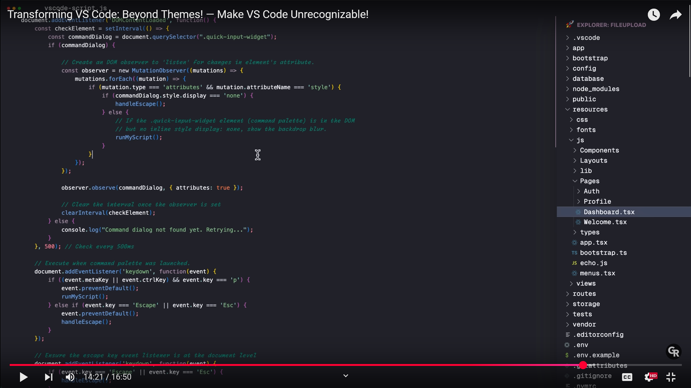
                <figcaption>Customized</figcaption>
            </tr>
    </table>

# Download VS Code

## Instructions for Windows
1. Go to [Visual Studio Code Downloads](https://code.visualstudio.com/download).
2. Select the **Windows** download.
3. Follow the installer prompts.
4. Launch VS Code and customize it to your preferences.

## Instructions for MacOS
1. Go to [Visual Studio Code Downloads](https://code.visualstudio.com/download).
2. Select the **macOS** download.
3. Drag and drop the app into your **Applications** folder.
4. Open VS Code. Confirm that macOS security settings allow opening apps from outside the App Store.

# Download the GitHub Repository

1. Go to [https://github.com/jjgecon/vs_code_workflow](https://github.com/jjgecon/vs_code_workflow).
2. Select `Code` → `Download ZIP`.
    <div align="center">
        
    </div>

    > Alternatively, you can clone the repository using the terminal or [GitHub Desktop](https://desktop.github.com/download/).
3. Unzip the files to your desired location.

# Open the `template_folder` Folder

There are two ways to open a folder with VS Code:

1. Select the `Open Folder` option on the *Welcome* page and locate the `./vs_code_workflow-main/template_folder` folder, then press open.

<div align="center">
    
</div>

2. Go to the menu bar at the top and select `File` → `Open Folder` and find the `template_folder` folder.

# Layout Explanation

This is the default layout of VS Code upon installation:

<div align="center">
    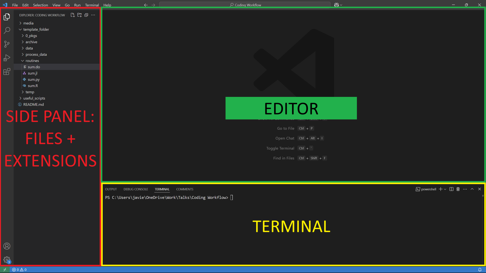
</div>

## Side Panel
The side panel in Visual Studio Code is typically located on the left side of the window. It contains several important views and tools that help you navigate and manage your project:
- **Explorer**: Displays the files and folders in your workspace. Open, create, delete, and manage files from here.
- **Source Control**: Integrates with version control systems like Git. View changes, commit, push, pull, and manage branches.
- **Search**: Allows you to search for text within your project files.
- **Extensions**: Browse and install extensions to add new features to VS Code.
- **Debug**: Provides tools to run and debug your code.

## Terminal
The integrated terminal in Visual Studio Code allows you to run command-line tasks directly within the editor. Open the terminal by clicking the terminal icon or using the keyboard shortcut `Ctrl+J` (Windows) or `Cmd+J` (Mac). The terminal supports multiple instances, so you can run different commands in separate terminals simultaneously.

## Editor
The text editor is the main area where you write and edit your code. It supports syntax highlighting, code completion, and other features to help you write code efficiently. Open multiple files in tabs and split the editor to view and edit files side by side.

## Command Palette

Press F1 or `Ctrl+Shift+P` (Windows) or `Cmd+Shift+P` (Mac) to quickly access commands and settings. [This post](https://docs.github.com/en/codespaces/reference/using-the-vs-code-command-palette-in-codespaces) explains some of its uses.

You should see the following command bar:

<div align="center">
    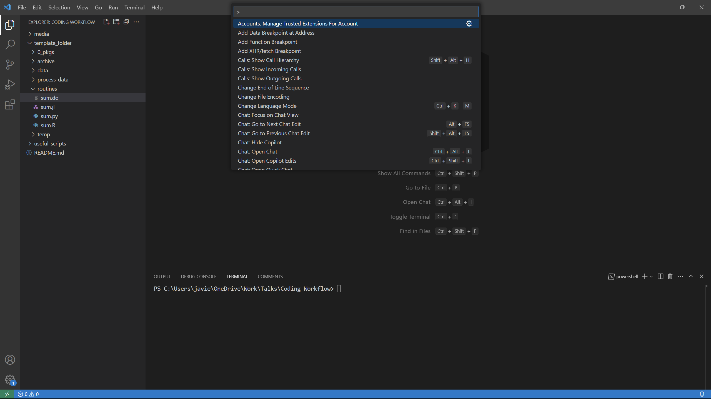
</div>

Another way to access any commands is to press `Ctrl+P` (Windows) or `Cmd+P` (Mac) and add a `>` at the start to do some commands.

See the following [video](https://youtu.be/ifTF3ags0XI?si=3NLIhwIUW_iXQZGw) to see more key shortcuts  that can help you with your day to day code.

## My Customizations

- **Move Terminal to the Right**: Right-click on the terminal and select the option `Panel Position` → `Right`.

- **Move the Activity Bar to the Top of the Side Panel**: Right-click on the activity bar and select the option `Activity Bar Position` → `Top`.

    <table>
        <tr>
            <td align="center">
                
                <figcaption>Terminal</figcaption>
            </td>
            <td align="center">
                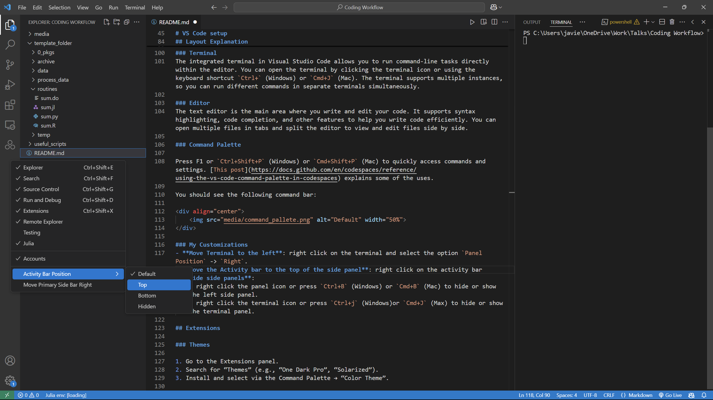
                <figcaption>Activity Bar</figcaption>
            </tr>
    </table>

- **Hide Unused Panels**: When I'm not using the side panel or the terminal, I like to hide them.
    - Right-click the panel icon or press `Ctrl+B` (Windows) or `Cmd+B` (Mac) to hide or show the left side panel.
    - Right-click the terminal icon or press `Ctrl+J` (Windows) or `Cmd+J` (Mac) to hide or show the terminal panel.
- **Enable Auto-save**:
    1. Open the Command Palette with `Ctrl+Shift+P` (Windows) or `Cmd+Shift+P` (Mac).
    2. Type `Preferences: Open Settings (UI)` and press Enter.
    3. In the search bar, type `Auto Save`.
    4. Select the `Files: Auto Save` dropdown and choose `afterDelay`.
    5. Optionally, adjust the `Files: Auto Save Delay` to your preference (e.g., for every 5 minutes, set it to `300000` milliseconds).

# Extensions
A Visual Studio Code (VS Code) extension is a package that adds new features or functionality to the VS Code editor. Extensions enhance your development experience by providing tools, themes, debuggers, and more.

For more information on VS Code extensions, visit the [Visual Studio Code Marketplace](https://marketplace.visualstudio.com/vscode).

To access the extensions view, click on the four squares in the Activity Bar:

<div align="center">
    
</div>

## Themes

1. Search for “Themes” (e.g., “One Dark Pro”, “Solarized”).
2. Install and select a theme via the Command Palette → “Color Theme”.

My current VS Code setup:

<div align="center">
    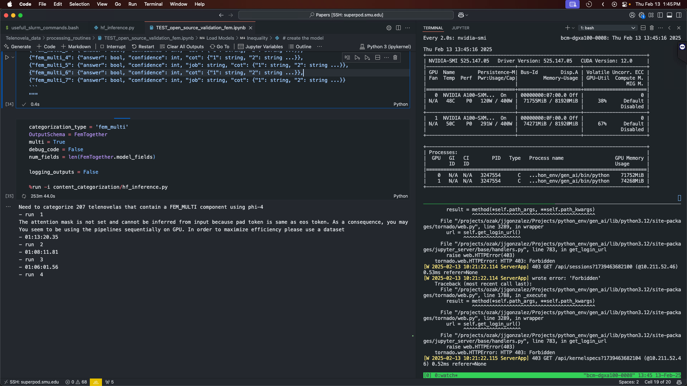
</div>

I'm currently using `GitHub Dark (Default)` from the [GitHub Theme](https://marketplace.visualstudio.com/items?itemName=GitHub.github-vscode-theme). I also really like the [Matchalk](https://marketplace.visualstudio.com/items?itemName=lucafalasco.matchalk) green theme.

# Let's Use VS Code

## Markdown

Let's start with Markdown, a simple language for writing text. (This file was written in Markdown.)

Open the file `my_explanation.md` using the file explorer. Alternatively, search for files with the keybind `Ctrl+P` (Windows) or `Cmd+P` (Mac).

Preview your Markdown by using the `Preview` button. Alternatively, use the command palette (`Ctrl+Shift+P` for Windows or `Cmd+Shift+P` Mac) and search for `Markdown: Open Preview to the Side`.

<div align="center">
    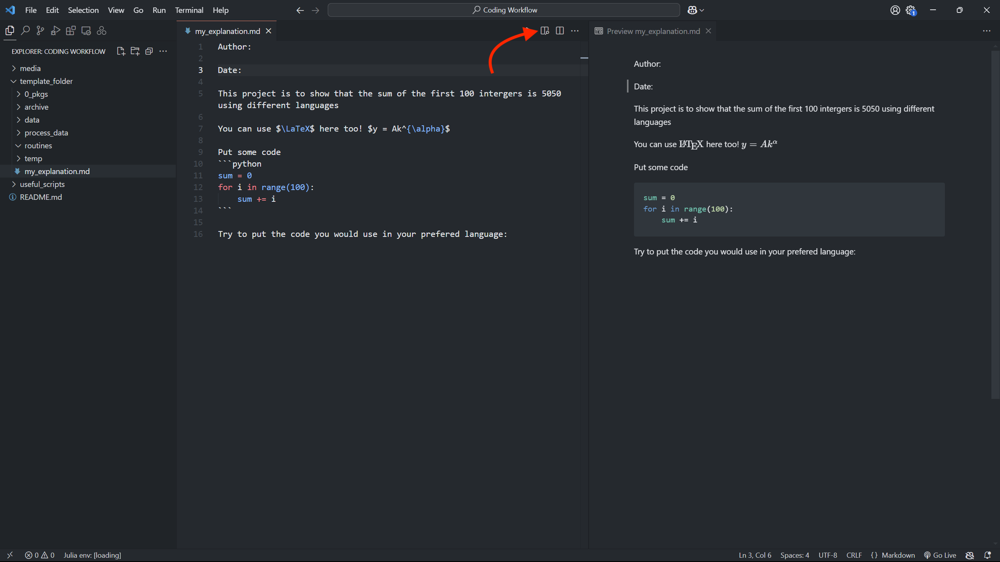
</div>

- **Markdown All in One** extension: Adds preview and syntax features.
- **MarkdownLint**: Helps maintain consistent formatting.

## Copilot

It's an AI chatbot inside VS Code that uses the power of popular models (e.g., ChatGPT, Claude, and Gemini). As a chatbot, you can ask it about coding, but the best part is that it can help you edit, explain, and debug code inside VS Code.

The best part is that with a `.edu` email, you have free access to GitHub Copilot.

To activate it:

1. You need a **GitHub account**.
    - Create an account if you don't have one at [https://github.com/](https://github.com/).

    > **Recommendation:** Create an account with your personal email. After that, you apply for *GitHub Education* following these [steps](https://docs.github.com/en/education/explore-the-benefits-of-teaching-and-learning-with-github-education/github-education-for-students/apply-to-github-education-as-a-student).

2. You need to have the GitHub Copilot VS Code extension installed.
    - Go to the Extensions tab and search for `GitHub Copilot`.

To check that you have Copilot enabled, you will see an icon on the top bar:

<div align="center">
    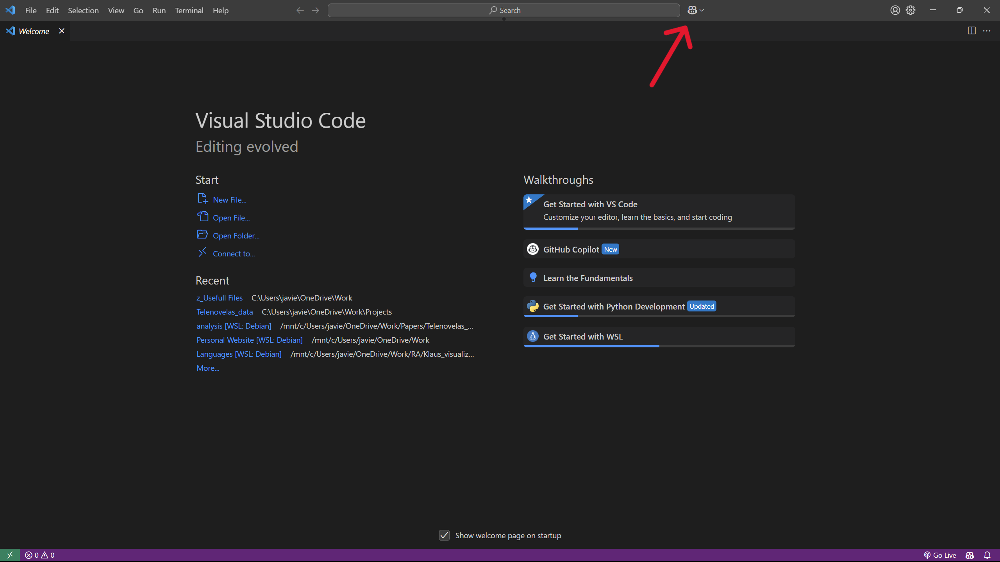
</div>

Click on it and follow the configuration steps.

### Using Copilot

#### In-line Chat
The easiest way to run Copilot is within a file. Press `Ctrl+I` (Windows) and `Cmd+I` (Mac), and a small chat window will appear on top of the line.

<div align="center">
    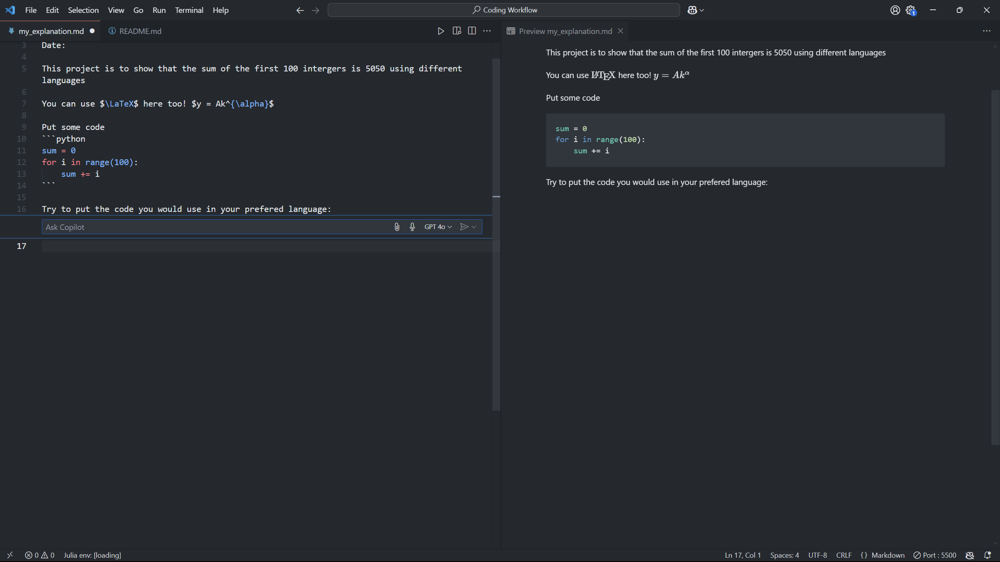
</div>

Notice a couple of things:

- There are four icons on the right side of the chat:

    1. A *clip* where you can add context to your query/prompt. For instance, if you want to reference another file in your workspace (or even your entire workspace/codebase), you can add it to improve its output.

    <div align="center">
        
    </div>

    2. A microphone, where you can use voice-to-text.
    3. The model you want to choose. In my testing, all of these are very good for coding, but be wary that the `o1` and `o3-mini` versions have a limit of calls per day.
    4. The last one is to send the prompt to be processed.

In the chatbox, you can type:
```
write the YOUR_PREFERED_LANGUAGE script to sum the first 100 integers below
```


Now Copilot will process the prompt and return with edits in your file:
#### Chat Side Bar

The other way is to use Copilot in a Chat. Click the Copilot icon at the top or press `Ctrl+Alt+I` (Windows) or `Cmd+Option+I` (Mac).

<div align="center">
    
</div>

For this part, you can ask Copilot to create simple scripts to sum the first 100 integers in all the programming languages you want by doing the following:

1. Set the context (click on the *clip*) as `Codebase`.
2. Paste the following prompt:
    ```
    Write separate scripts in Python, Julia, R, Stata, and MATLAB to sum the first 100 integers and print the answers. 
    Please name all the files as "sum_100" with the correct file extension for each language and save them in the routines folder. I don't want to create a new workspace.
    ```
    > If you get an answer prompting to create a new workspace, just retry the prompt.
3. Now, move the cursor to one of the code snippets and select the option `Apply to routines/sum_100.XX` where `XX` depends on the programming language you selected. Save the file and you are done!

    <div align="center">
        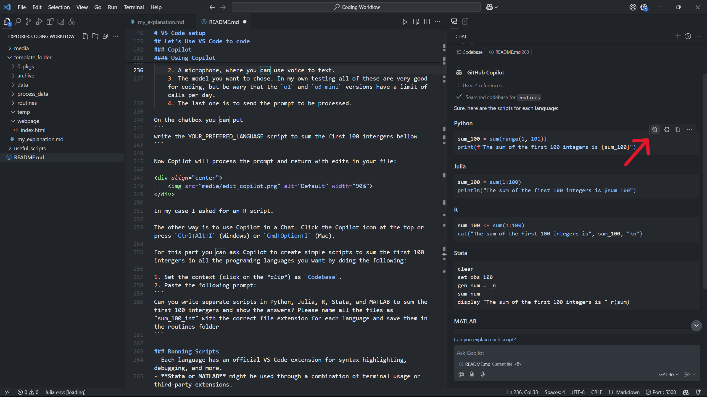
    </div>

    <div class="callout">
            <strong>Note:</strong> Sometimes the outputs of Copilot are not perfect, and you might need to do some copy-pasting.
    </div>

To close the chat box, right-click and select `Hide Secondary Side Bar`.

#### In-line Suggestions

Copilot can also give you suggestions while you code. For example, it can give you another way to calculate the first 100 integers in `python`. Just press `TAB` to accept the changes and new suggestions will appear.

<div align="center">
        
</div>

If you want to get the most out of your in-line suggestions there is a new model ChatGPT + Copilot. To activate it just go to the github button at the top and click on the arrow. Select `Configure Code Completions` → `Change Completions Model` → `GPT-4o Copilot (Preview)`. For an overview of the new features of the model please watch [this video](https://youtu.be/Oi_O6SZZWPc?si=VVQclBNW6xlmlI7X).

<div class="callout">
        Copilot has a lot of features coming up. This <a href="https://www.youtube.com/watch?v=C95drFKy4ss&t=306s">video</a> highlights agents. Feel free to browse through <a href="https://github.com/features/copilot">GitHub Copilot Features</a> for all its features.
</div>


## Running Scripts
- Each language has an official VS Code extension for syntax highlighting, debugging, and more.  
- **Stata or MATLAB** might be used through a combination of terminal usage or third-party extensions.
    - For Stata, there is `statRun` but it requires some configuration beforehand. 

To run a script, just download the corresponding extension (which usually has the name of the language).

> **Note**: Different languages have different ways of running scripts and different keybinds, but usually, clicking the play button is sufficient. Behind the scenes, it executes the script in the terminal.

<div align="center">
        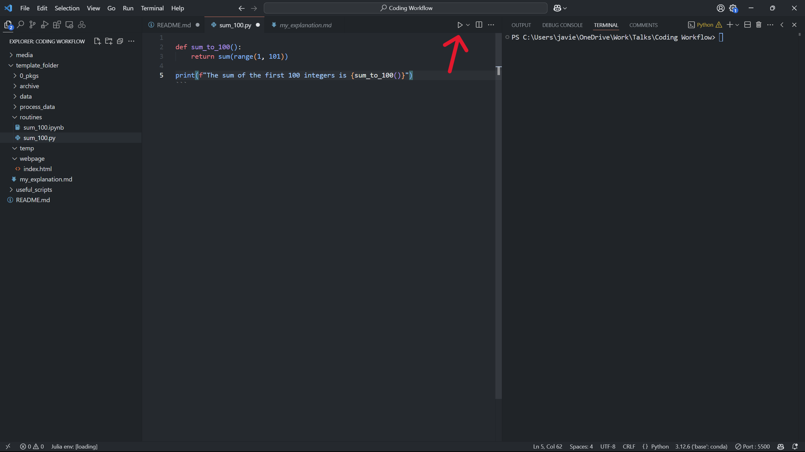
</div>

The output will look something like this:
```shell
C:/Users/javie/miniforge3/python.exe "c:/Users/javie/OneDrive/Work/Talks/Coding Workflow/template_folder/routines/sum_100.py"
The sum of the first 100 integers is 5050
```

Pressing `Shift-Enter` (Windows/Mac) runs the interactive shell, which calls on `python` to run interactively. The python outcome should be similar to:

```shell
PS C:\Users\javie\OneDrive\Work\Talks\Coding Workflow> & C:/Users/javie/miniforge3/python.exe
Python 3.12.6 | packaged by conda-forge | (main, Sep 22 2024, 14:01:26) [MSC v.1941 64 bit (AMD64)] on win32
Type "help", "copyright", "credits" or "license" for more information.
>>> def sum_to_100():
...     return sum(range(1, 101))
... 
>>> print(f"The sum of the first 100 integers is {sum_to_100()}")
The sum of the first 100 integers is 5050
>>> 
```

## Jupyter Notebooks
- Download the `Jupyter` extension from the Extensions tab.
- Open the notebook `./routines/sum_100.ipynb`.
- Go to the top right and press `Select Kernel`.
- You will then need to choose the kernel you want to use. If you want to use the python kernel, click on `Python Environments`; if you want to use julia, press `Julia release channel`.
    > Selecting `Python Environments` allows you to even create a new environment. Just follow the instructions.
- Now you can run the cells and play around with it!

## Web Development
- Extensions for **HTML**, **CSS**, **JavaScript** (e.g., ESLint, Live Server).
- You can edit your HTML file and view your edits live with the `Live Server` extension.

To test it out:
1. Install the `Live Server` extension.
2. Open the file `webpage/index.html`.
3. Right-click on the file `webpage/index.html` → `Open with Live Server`. A new browser window will render the `HTML` file. Every time you save that `HTML` file, you will see the changes in the webpage.

<div align="center">
        
</div>

# HPC
SMU has [High Power Computing (HPC)](https://www.smu.edu/oit/research/hpc) available for students. The [M3](https://www.smu.edu/oit/services/m3) supercomputer focuses on CPU power, while the [Superpod](https://www.smu.edu/oit/services/superpod) uses GPU power.

One way to understand the difference between them is that a CPU node is designed to focus on one task, while GPUs are designed to focus on multiple tasks at a time.

As an example, if we want to sum up from 1 to 5, the CPU (without any parallelization) will go:

```
0 + 1  = 1
1 + 2  = 3
3 + 3  = 6
6 + 4  = 10
10 + 5 = 15
```

The GPU will instead:

```
0 + 1 + 2 = 3
3 + 4 + 5 = 12
3 + 12 = 15
```
Since text generation models like ChatGPT are essentially a bunch of matrix multiplications, it's better to deploy these models in GPUs (For a brief overview of these models I recommend
3Blue1Brown’s YouTube video [Large Language Models explained briefly](https://youtu.be/LPZh9BOjkQs?si=Nchg-eFObxSRqTOJ)).

Here is a table summarizing the differences from [AWS](https://aws.amazon.com/compare/the-difference-between-gpus-cpus/):

| Summary of differences | CPU | GPU |
|-------------------------------------|-----|-----|
| **Function**                        | Generalized component that handles main processing functions of a server | Specialized component that excels at parallel computing |
| **Processing**                      | Designed for serial instruction processing | Designed for parallel instruction processing |
| **Design**                          | Fewer, more powerful cores | More cores than CPUs, but less powerful than CPU cores |
| **Best suited for**                 | General purpose computing applications | High-performance computing applications |

*For any problem, I recommend that you contact [OIT support](https://www.smu.edu/oit/services/stable). The people in charge of the HPC are incredibly helpful*.

## Host and Tunnels with VS Code

To access SMU's HPC, you need to have an account with access to a ColdFront Allocation. The OIT has generated some [documentation](https://southernmethodistuniversity.github.io/hpc_docs/coldfront/quick_start.html) on how to use ColdFront and request storage and allocation resources.

As a student, you might need to ask your Advisor or Dr. Sposi to give you an allocation.

> You can only access the HPC while connected to the SMU network. You could do it through a VPN, but I haven't tried that yet.

## Linux System

The HPC uses the Linux operating system, which you interface with through the terminal.

Here are some basic commands:
- `ls`: List files and directories.
- `cd <directory>`: Change directory.
- `pwd`: Print working directory.
- `cp <source> <destination>`: Copy files or directories.
- `mv <source> <destination>`: Move or rename files or directories.
- `rm <file>`: Remove files.
- `rmdir <directory>`: Remove empty directories.

When using VS Code, you don't necessarily need to use the terminal as you can drag/copy/move files in the explorer as on your own computer. However, it uses those terminal commands in the background.

## Connecting via SSH to M3

1. Install the **Remote - SSH** extension.
2. Access the **Remote** by clicking on the icon in the activity panel or click on the bottom-left corner.
    <div align="center">
            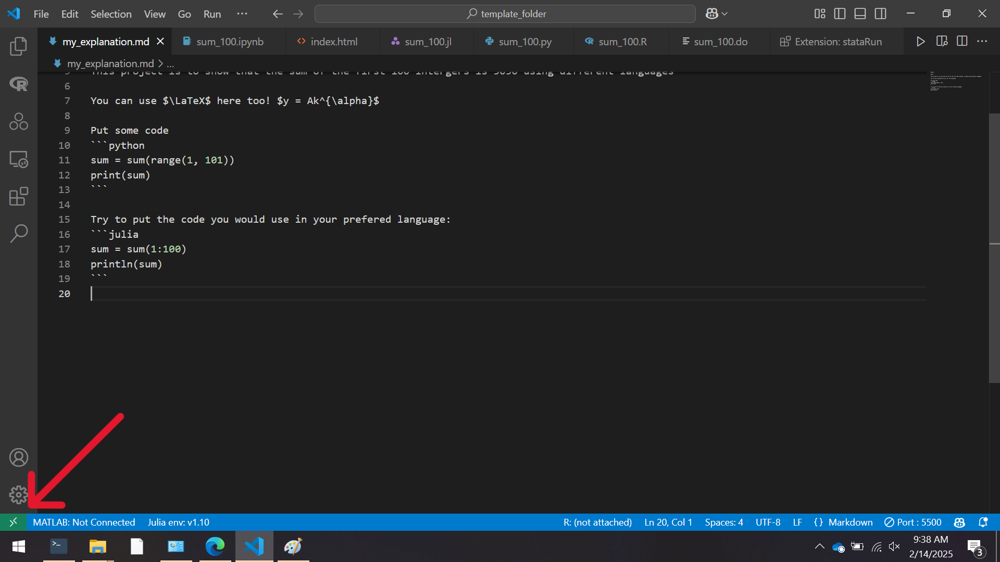
    </div>
3. Select `Connect to Host...` → `Add New SSH Host...` and type:
    ```
    ssh YOUR_SMU_ACCOUNT@m3.smu.edu
    ```

    > Note that if you want to connect to Superpod, you need to replace `m3` with `superpod`.

4. Select the first config suggested. This saves some data to authorize the connection.
5. Now, press the bottom-left corner again. Select `Connect to Host...` →  `m3.smu.edu`.
6. A new window will open. Select `Linux` (this is the operating system of the HPC).
    <div align="center">
        
    </div>
7. Enter your password for your SMU account.
    > If nothing is showing, you can click on **details** at the bottom right to pull up the terminal. However, it's recommended that you only input things at the top.
    > If it keeps asking you for your password, restart the connection.
8. The next prompt should be to select your DUO device to authorize the user.
    > Sometimes this option doesn't show up, so click on **details** in the bottom right.
        <div align="center">
            
        </div>
    > It also happens that the prompt will say password, but it's actually the DUO service. To make sure, click on the **details**.
        <div align="center">
            
        </div>
9. Once inside, press on the **File Explorer** and click `Open Folder`.
    <div align="center">
        
    </div>
10. Another command bar will show, just click `OK` for now.
    > Here you are selecting the folder or directory you want to open. If you want to open another directory just go to it using the command bar. If you have an allocation under your advisor, you will need to navigate the HPC file system to find your advisors user name and your allocation will be within those folders.
    <div align="center">
        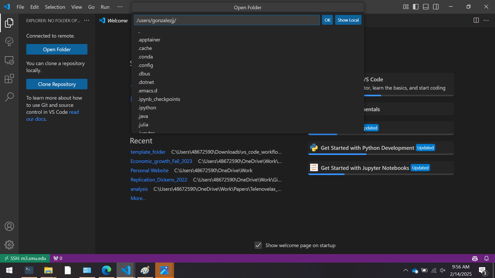
    </div>
11. Log in again with steps 7-8.
12. Now you are in your HPC work directory.
    > Usually, what I do is create a symbolic link to my ColdFront storage allocation in the work folder on the M3 and Superpod. That way, I don't run into storage issues.

Notice that you need to reconfigure VS Code, since it's installed on another machine.

## Run Scripts
The following scripts will work without needing to request resources or an allocation from M3. However, if you want to request more resources (e.g., use 2 GPUs or several CPU cores or nodes), please refer to the [Requesting More System Resources in the HPC](#requesting-more-system-resources-in-the-hpc) section.

1. Upload the `template_folder/` by dragging the folder and dropping it into the explorer on the left side.
2. Go to the terminal, and you will see a lot of info on the connection to the HPC. Now press the `+` button to create a new terminal.
    <div align="center">
        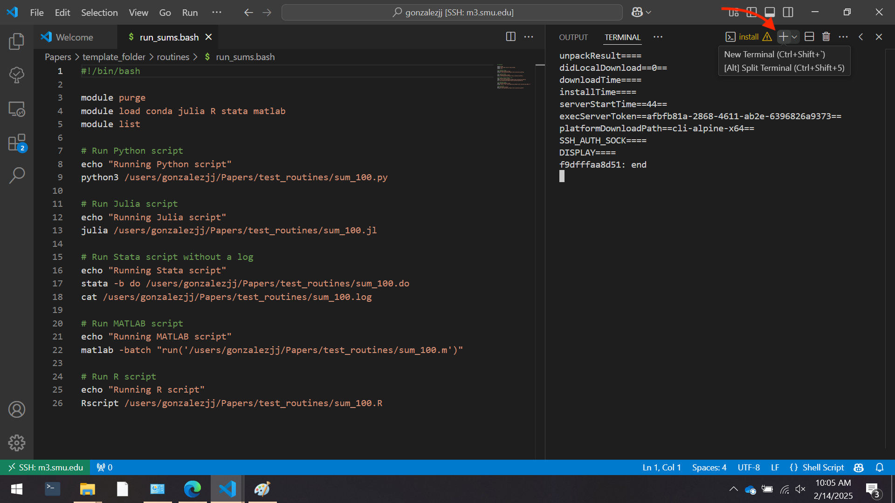
    </div>
2. Go to the `template_folder/` directory:
    ```shell
    cd ~/template_folder/routines/
    ```
3. To run each file, run the following `run_sums.bash` script:
    ```shell
    bash run_sums.bash 
    ```
    > Make sure that each script is called `sum_100.XX` where `XX` is the language extension. An example of how to run batch codes in the HPC is found in `./useful_codes/test_sbatch_code.bash`, and you can see the `run_sums.bash` to see how to call different scripts. Be sure to load the corresponding modules.

## Connect to your Jupyter Notebook in the HPC

If you already have a python environment ready, you can skip steps 1-4 and just activate the environment before starting step 5.

1. Load the necessary modules:
    ```shell
    module purge        # just to make sure no other modules are loaded
    module load conda   # load the python pkg manager
    module list         # to check python was loaded
    ```
    > To run other languages, you just need to load them using the `module load MODULE` command. You can see the available modules using the `module avail list`. 
2. Create a Python virtual environment:  
   ```shell
   python -m venv test_env
   ```

   > It's recommended that you use a virtual environment for each project when using python.

3. Activate the virtual environment:
   ```shell
   source test_env/bin/activate 
   ```
4. Install Jupyter:  
   ```shell
   pip install jupyter ipykernel
   ```
5. Start Jupyter on the HPC with a tunnel:
   ```shell
   jupyter lab --ip=0.0.0.0 --no-browser
   ```
6. Copy the link in the Jupyter server as seen below:
    <div align="center">
        
    </div>
5. Create a new `test_notebook.ipynb` or open `sum_100.ipynb`.
6. At the top, press `Select Kernel` → `Existing Jupyter Server...`, and paste the link and press enter.
    > If one link does not work, try to use the other link.
7. Select the `Python 3 (ipykernel)`.
8. Everything should work now!

> To shut down the server, just press `Ctrl+C` and confirm with `y`.

## Requesting More System Resources in the HPC

If you need more resources from the HPC, you will need to use your ColdFront allocation. To request more resources, I have two `bash` scripts: (i) `useful_codes/interactive_m3_resources.bash` and (ii) `interactive_superpod_resources.bash`. 

These scripts will ask for some information about how many CPU, GPU, memory, and time you need to run an interactive job.

**BEFORE** running any of the scripts, you need to change the YOUR_ALLOCATION within the scripts with the ColdFront allocation. See the [documentation](https://southernmethodistuniversity.github.io/hpc_docs/coldfront/qs_student.html) to find your allocation name.
```bash
...
# Generate the srun command
command="srun -A YOUR_ALLOCATION -p${partition}  -N${cpu_count} -n${core_count} --mem=${memory}gb --time=${time} --pty \$SHELL"
...
```

### Calling a Job with `sbatch`

The code `useful_codes/test_sbatch_code.bash` is an example of how you can send jobs to the HPC that do not require interaction. It works as a sequence of terminal commands and starts with the computing resources you need as well as other information. To learn more about sending jobs, please refer to the [documentation](https://southernmethodistuniversity.github.io/hpc_docs/tutorials/slurm/best_practices.html).
